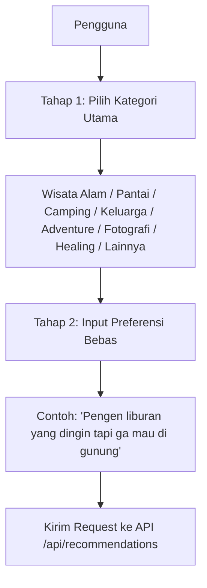

# Jabarulin AI

**Sistem Rekomendasi Wisata Cerdas Berbasis NLP di Jawa Barat**  
*Fine-Tuned IndoBERT Classifiers + TF-IDF Semantic Search + Multi-Stage Hybrid Ranking + Region & Negation Filtering*  
*Capstone Project PJK-GM049 — Kolaborasi Pijak × IBM SkillsBuild*

---

## Deskripsi Singkat

Jabarulin AI adalah sebuah sistem cerdas yang memecahkan masalah wisatawan dalam mencari destinasi spesifik di Jawa Barat menggunakan bahasa sehari-hari. Berbeda dengan pencarian konvensional yang kaku, sistem ini menggunakan pendekatan terpadu dua tahap (*guided recommendation*) dan memproses query secara semantik menggunakan kecerdasan buatan berbasis model bahasa **IndoBERT** yang di-fine-tune.

---

## 🤖 Spesifikasi Model AI & Alur Input

### 1. Model AI yang Digunakan (IndoBERT Hybrid)
Sistem ini bermigrasi sepenuhnya ke arsitektur **Hybrid AI Pipeline v3.0** berbasis model deep learning **IndoBERT**:
* **Base Model:** `indobenchmark/indobert-base-p1` (di-fine-tune secara khusus untuk klasifikasi preferensi pariwisata Jawa Barat).
* **Lokasi Penyimpanan Model:** Dihosting di Hugging Face Hub **[Dhaffa/jabarulin-indobert-recommendation](https://huggingface.co/Dhaffa/jabarulin-indobert-recommendation)**. Sistem secara otomatis mengunduh weights model (~500MB) saat pertama kali dijalankan (baik via Docker maupun lokal) untuk menghindari penyimpanan file berukuran besar di repositori Git.
* **Arsitektur Hybrid Scoring:**
  * **IndoBERT Classifier (20%):** Memprediksi probabilitas intent kategori pariwisata (`preference_match`) dari input teks pengguna.
  * **Semantic Search (50%):** Menggabungkan **40% TF-IDF Cosine Similarity** (untuk pencarian kata kunci yang presisi) dan **30% IndoBERT Mean-Pooled Embeddings** (untuk menangkap kesamaan makna semantik secara mendalam).
  * **Category Match (15%):** Kecocokan kategori utama yang dipilih pengguna pada Tahap 1 dengan destinasi wisata.
  * **Rating Score (10%) & Popularity Score (5%):** Bobot tambahan berdasarkan rating rata-rata Google Maps dan jumlah ulasan untuk memastikan rekomendasi berkualitas tinggi.
* **Post-Filtering:**
  * **Normalisasi Query:** Secara otomatis membersihkan slang, singkatan, dan typo Bahasa Indonesia (misal: *"gw mau hiling yg adem"* diubah menjadi *"saya mau healing yang dingin"*).
  * **Filter Negasi:** Mengabaikan objek wisata dari kelompok yang ditolak pengguna secara dinamis (seperti *"tidak mau gunung"*, *"jangan pantai"*).
  * **Filter Lokasi:** Otomatis menyaring dan membatasi daerah pencarian jika pengguna menyebutkan wilayah spesifik di Jawa Barat (seperti *"di Garut"*, *"di Bandung"*).

### 2. Alur Input Pengguna (2 Tahap)
Untuk menghasilkan rekomendasi yang akurat dan relevan, sistem menerapkan **Mekanisme Input Dua Tahap** pada antarmuka pengguna:



* **Tahap 1: Pemilihan Kategori Wisata (Guided Selection)**
  Pengguna memilih satu kategori utama dari opsi yang disediakan:
  | Kategori | Cakupan/Deskripsi Destinasi |
  | :--- | :--- |
  | **Wisata Alam** | Air Terjun, Danau, Cagar Alam, Bukit |
  | **Pantai** | Pantai, Pantai Umum, Pesisir Laut |
  | **Camping** | Bumi Perkemahan, Kabin Perkemahan, Glamping |
  | **Keluarga** | Kebun Binatang, Kolam Renang, Taman Rekreasi Air, Taman Bermain |
  | **Adventure** | Rafting, Offroad, Gunung Berapi, Puncak Gunung, Area Mendaki |
  | **Fotografi** | Titik Pemandangan, Bangunan Bersejarah |
  | **Healing** | Pemandian Air Panas, Spa, Hotel Resor, Pemandian Terbuka |
  | **Lainnya** | Hotel, Produsen Makanan, Pembangkit Listrik, Event Organizer, dsb. |

* **Tahap 2: Input Preferensi Tambahan (Natural Language Prompt)**
  Pengguna menuliskan query bebas dalam bahasa alami/sehari-hari untuk merinci preferensi mereka (seperti suhu udara, keramaian, atau pengecualian tertentu).

* **Integrasi Generative AI (Google Gemini LLM):**
  Setelah AI lokal (FastAPI) memproses input dua tahap tersebut dan menyaring 3 destinasi terbaik dari dataset, hasilnya dikirim ke **Google Gemini (gemini-2.5-flash)** di backend Node.js untuk dirakit menjadi tanggapan interaktif, santai, dan bersahabat kepada pengguna beserta tautan Google Maps.

---

## Struktur Monorepo

Repository ini telah dirancang agar bebas dari penyimpanan model berukuran besar di Git (menggunakan Hugging Face Hub untuk model hosting):

```text
Jabarulin_Project/
├── Model_AI/                      <-- (AI Service - Python)
│   ├── notebooks/                 # Notebook pelatihan (jabarulin_indobert_recommendation.ipynb)
│   ├── app.py                     # Script utama FastAPI (AI Engine dengan HF model loading)
│   ├── data wisata jawabarat.xlsx # Dataset asli pariwisata Jawa Barat
│   ├── requirements.txt           # Dependensi Python (PyTorch, Transformers, dll)
│   └── Dockerfile                 # Konfigurasi Docker AI
│
├── Backend/                       <-- (Backend Service - Node.js)
│   ├── controllers/
│   │   └── recommendationController.js # Integrasi FastAPI & Gemini LLM
│   ├── routes/
│   │   └── apiRoutes.js            # Pengaturan rute Express
│   ├── package.json                # Dependensi Backend
│   ├── server.js                   # Script utama Express
│   └── Dockerfile                  # Konfigurasi Docker Backend
│
├── docker-compose.yml             <-- (Konduktor Orkestrasi Docker)
└── .gitignore                     # Mengabaikan model lokal besar
```

> **Catatan Model ML:** Folder `Model_AI/indobert_classifier/` yang berisi file model besar (~500MB) diabaikan oleh git. Saat dijalankan pertama kali di Docker atau local tanpa folder tersebut, aplikasi secara otomatis mengunduh file model (`model.safetensors`, `config.json`, `label_encoder.pkl`, `tourism_embeddings.pkl`, dll.) dari Hugging Face repository **[Dhaffa/jabarulin-indobert-recommendation](https://huggingface.co/Dhaffa/jabarulin-indobert-recommendation)**.

---

## Cara Menggunakan (Mulai dari Nol)

### ⚙️ Persiapan Awal & Konfigurasi `.env`
1. Lakukan `git clone` repository ini ke komputer Anda.
2. Dapatkan API Key Gemini dari [Google AI Studio](https://aistudio.google.com/).
3. Masuk ke folder `Backend/`, copy `.env.example` menjadi `.env`.
4. Isi variabel `GEMINI_API_KEY` dengan API Key milik Anda.
5. (Opsional) Jika repositori Hugging Face bersifat private, tambahkan variabel `HF_TOKEN=token_anda` pada file `.env` tersebut.

---

### OPSI 1: Menjalankan via Docker (Direkomendasikan)
1. Jalankan perintah berikut di direktori utama:
   ```bash
   docker-compose up --build
   ```
2. Tunggu hingga proses build selesai. Sistem akan otomatis mendownload model dari Hugging Face Hub dan menyalakan container:
   - Backend Service berjalan di: `http://localhost:5000`
   - AI Service berjalan di: `http://localhost:8000`

---

### OPSI 2: Menjalankan Secara Manual (Tanpa Docker)

#### Terminal 1: AI Service (Python FastAPI)
1. Masuk ke folder `Model_AI` dan buat virtual environment.
2. Install dependensi:
   ```bash
   pip install -r requirements.txt
   ```
3. Jalankan server FastAPI:
   ```bash
   python app.py
   ```

#### Terminal 2: Backend Service (Node.js)
1. Masuk ke folder `Backend`.
2. Install dependensi:
   ```bash
   npm install
   ```
3. Jalankan server Express:
   ```bash
   npm start
   ```

---

## 🌐 Daftar URL & Endpoint

### 1. Backend Service (Node.js) — Port 5000
- **API Rekomendasi (Node.js -> AI Lokal -> Gemini):** `POST http://localhost:5000/api/recommendations`
  - *Payload (JSON):*
    ```json
    {
      "category": "Camping",
      "prompt": "Pengen liburan yang dingin tapi ga mau di gunung"
    }
    ```

### 2. AI Service (FastAPI) — Port 8000
- **Dokumentasi Swagger UI:** [http://localhost:8000/docs](http://localhost:8000/docs)
- **API Rekomendasi (Lokal AI saja):** `POST http://localhost:8000/api/recommend`
  - *Payload (JSON):*
    ```json
    {
      "category": "Camping",
      "query": "Pengen liburan yang dingin tapi ga mau di gunung",
      "top_n": 3
    }
    ```

---

## 🧪 Uji Coba Input & Output (Postman / cURL)

**Request Body (JSON):**
```json
{
  "category": "Camping",
  "prompt": "Pengen liburan yang dingin tapi ga mau di gunung"
}
```

**Response Body (JSON):**
```json
{
  "status": "success",
  "reply": "Halo wargi! Pengen liburan sejuk tapi males nanjak gunung yang melelahkan? Pas banget! Jabarulin punya beberapa rekomendasi tempat camping berudara dingin di dataran rendah yang pastinya nyaman dan tanpa harus mendaki puncak gunung:\n\n1. **Bukit Cita Cita Camping Ground**\nLokasinya berada di kawasan Puncak, Bogor yang udaranya sudah terjamin sangat dingin dan sejuk. Tempatnya asri dan menyuguhkan pemandangan perkebunan teh. Sangat cocok untuk mendirikan tenda dan bersantai.\n*Rating:* 4.5/5 \n[Buka di Google Maps](https://www.google.com/maps/place/...)\n\n2. **Bumi Perkemahan Batu Kuda Manglayang**\nTerletak di kaki gunung Manglayang Bandung. Kamu bisa merasakan camping sejuk di tengah hutan pinus yang tenang tanpa perlu mendaki ke puncak gunungnya. Toilet dan fasilitas warung makan di sini cukup lengkap.\n*Rating:* 4.6/5\n[Buka di Google Maps](https://www.google.com/maps/place/...)\n\nSemoga liburan camping adem kamu menyenangkan!",
  "raw_data": [
    {
      "name": "Bukit Cita Cita Camping Ground",
      "category": "bumi perkemahan",
      "intent_label": "camping",
      "address": "citamiang jl raya puncak tugu utara kec cisarua kabupaten bogor jawa barat 16750",
      "phone": "0822 9992 9869",
      "website": "https://www.instagram.com/real...",
      "rating": 4.5,
      "total_reviews": 864,
      "google_maps_url": "https://www.google.com/maps/place/...",
      "similarity_score": 0.311,
      "final_score": 0.434,
      "reviews": [
        "pengalaman pertama kesini agak kurang mengenakan tendanya belum ready..."
      ],
      "preference_match": 0.042,
      "category_match": 1.0
    },
    {
      "name": "Bumi Perkemahan Batu Kuda Manglayang",
      "category": "bumi perkemahan",
      "intent_label": "camping",
      "address": "4p4w r5m cikoneng satu cibiru wetan kec cileunyi kabupaten bandung jawa barat 40625",
      "phone": "tidak tersedia",
      "website": "tidak tersedia",
      "rating": 4.6,
      "total_reviews": 3699,
      "google_maps_url": "https://www.google.com/maps/place/...",
      "similarity_score": 0.291,
      "final_score": 0.433,
      "reviews": [
        "tempatnya luas banget buat camp yang lengkap sama toiletnya ada banyak..."
      ],
      "preference_match": 0.042,
      "category_match": 1.0
    }
  ]
}
```

---

## Tim Pengembang

**Capstone Project PJK-GM049**