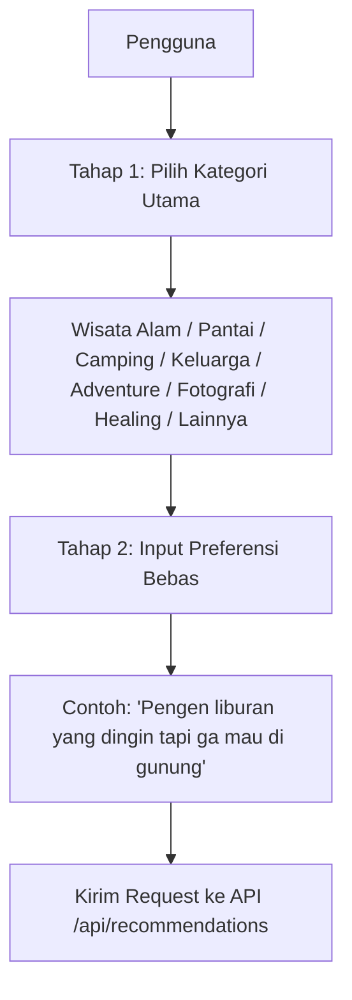

# Jabarulin AI

**Sistem Rekomendasi Wisata Cerdas Berbasis NLP di Jawa Barat**  
*Fine-Tuned IndoBERT Classifiers + TF-IDF Semantic Search + Multi-Stage Hybrid Ranking + Region & Negation Filtering*  
*Capstone Project PJK-GM049 — Kolaborasi Pijak × IBM SkillsBuild*

---

## Deskripsi Singkat

Jabarulin AI adalah sebuah sistem cerdas yang memecahkan masalah wisatawan dalam mencari destinasi spesifik di Jawa Barat menggunakan bahasa sehari-hari. Berbeda dengan pencarian konvensional yang kaku, sistem ini menggunakan pendekatan terpadu dua tahap (*guided recommendation*) dan memproses query secara semantik menggunakan kecerdasan buatan berbasis model bahasa **IndoBERT** yang di-fine-tune.

---

## 🤖 Spesifikasi Model AI & Alur Input

### 1. Model AI yang Digunakan (IndoBERT Hybrid)
Sistem ini bermigrasi sepenuhnya ke arsitektur **Hybrid AI Pipeline v3.0** berbasis model deep learning **IndoBERT**:
* **Base Model:** `indobenchmark/indobert-base-p1` (di-fine-tune secara khusus untuk klasifikasi preferensi pariwisata Jawa Barat).
* **Lokasi Penyimpanan Model:** Dihosting di Hugging Face Hub **[Dhaffa/jabarulin-indobert-recommendation](https://huggingface.co/Dhaffa/jabarulin-indobert-recommendation)**. Sistem secara otomatis mengunduh weights model (~500MB) saat pertama kali dijalankan (baik via Docker maupun lokal) untuk menghindari penyimpanan file berukuran besar di repositori Git.
* **Arsitektur Hybrid Scoring:**
  * **IndoBERT Classifier (20%):** Memprediksi probabilitas intent kategori pariwisata (`preference_match`) dari input teks pengguna.
  * **Semantic Search (50%):** Menggabungkan **40% TF-IDF Cosine Similarity** (untuk pencarian kata kunci yang presisi) dan **30% IndoBERT Mean-Pooled Embeddings** (untuk menangkap kesamaan makna semantik secara mendalam).
  * **Category Match (15%):** Kecocokan kategori utama yang dipilih pengguna pada Tahap 1 dengan destinasi wisata.
  * **Rating Score (10%) & Popularity Score (5%):** Bobot tambahan berdasarkan rating rata-rata Google Maps dan jumlah ulasan untuk memastikan rekomendasi berkualitas tinggi.
* **Post-Filtering:**
  * **Normalisasi Query:** Secara otomatis membersihkan slang, singkatan, dan typo Bahasa Indonesia (misal: *"gw mau hiling yg adem"* diubah menjadi *"saya mau healing yang dingin"*).
  * **Filter Negasi:** Mengabaikan objek wisata dari kelompok yang ditolak pengguna secara dinamis (seperti *"tidak mau gunung"*, *"jangan pantai"*).
  * **Filter Lokasi:** Otomatis menyaring dan membatasi daerah pencarian jika pengguna menyebutkan wilayah spesifik di Jawa Barat (seperti *"di Garut"*, *"di Bandung"*).

### 2. Alur Input Pengguna (2 Tahap)
Untuk menghasilkan rekomendasi yang akurat dan relevan, sistem menerapkan **Mekanisme Input Dua Tahap** pada antarmuka pengguna:



* **Tahap 1: Pemilihan Kategori Wisata (Guided Selection)**
  Pengguna memilih satu kategori utama dari opsi yang disediakan:
  | Kategori | Cakupan/Deskripsi Destinasi |
  | :--- | :--- |
  | **Wisata Alam** | Air Terjun, Danau, Cagar Alam, Bukit |
  | **Pantai** | Pantai, Pantai Umum, Pesisir Laut |
  | **Camping** | Bumi Perkemahan, Kabin Perkemahan, Glamping |
  | **Keluarga** | Kebun Binatang, Kolam Renang, Taman Rekreasi Air, Taman Bermain |
  | **Adventure** | Rafting, Offroad, Gunung Berapi, Puncak Gunung, Area Mendaki |
  | **Fotografi** | Titik Pemandangan, Bangunan Bersejarah |
  | **Healing** | Pemandian Air Panas, Spa, Hotel Resor, Pemandian Terbuka |
  | **Lainnya** | Hotel, Produsen Makanan, Pembangkit Listrik, Event Organizer, dsb. |

* **Tahap 2: Input Preferensi Tambahan (Natural Language Prompt)**
  Pengguna menuliskan query bebas dalam bahasa alami/sehari-hari untuk merinci preferensi mereka (seperti suhu udara, keramaian, atau pengecualian tertentu).

* **Integrasi Generative AI (Google Gemini LLM):**
  Setelah AI lokal (FastAPI) memproses input dua tahap tersebut dan menyaring 3 destinasi terbaik dari dataset, hasilnya dikirim ke **Google Gemini (gemini-2.5-flash)** di backend Node.js untuk dirakit menjadi tanggapan interaktif, santai, dan bersahabat kepada pengguna beserta tautan Google Maps.

---

## Struktur Monorepo

Repository ini telah dirancang agar bebas dari penyimpanan model berukuran besar di Git (menggunakan Hugging Face Hub untuk model hosting):

```text
Jabarulin_Project/
├── Model_AI/                      <-- (AI Service - Python)
│   ├── notebooks/                 # Notebook pelatihan (jabarulin_indobert_recommendation.ipynb)
│   ├── app.py                     # Script utama FastAPI (AI Engine dengan HF model loading)
│   ├── data wisata jawabarat.xlsx # Dataset asli pariwisata Jawa Barat
│   ├── requirements.txt           # Dependensi Python (PyTorch, Transformers, dll)
│   └── Dockerfile                 # Konfigurasi Docker AI
│
├── Backend/                       <-- (Backend Service - Node.js)
│   ├── controllers/
│   │   └── recommendationController.js # Integrasi FastAPI & Gemini LLM
│   ├── routes/
│   │   └── apiRoutes.js            # Pengaturan rute Express
│   ├── package.json                # Dependensi Backend
│   ├── server.js                   # Script utama Express
│   └── Dockerfile                  # Konfigurasi Docker Backend
│
├── docker-compose.yml             <-- (Konduktor Orkestrasi Docker)
└── .gitignore                     # Mengabaikan model lokal besar
```

> **Catatan Model ML:** Folder `Model_AI/indobert_classifier/` yang berisi file model besar (~500MB) diabaikan oleh git. Saat dijalankan pertama kali di Docker atau local tanpa folder tersebut, aplikasi secara otomatis mengunduh file model (`model.safetensors`, `config.json`, `label_encoder.pkl`, `tourism_embeddings.pkl`, dll.) dari Hugging Face repository **[Dhaffa/jabarulin-indobert-recommendation](https://huggingface.co/Dhaffa/jabarulin-indobert-recommendation)**.

---

## ⚙️ Panduan Instalasi & Jalankan Proyek

Untuk mempermudah proses setup dan instalasi di lingkungan pengembangan lokal Anda, panduan instalasi teknis telah dipisahkan ke dalam dokumen tersendiri. Panduan ini menjelaskan prasyarat, konfigurasi berkas `.env`, cara menjalankan menggunakan Docker Compose, serta langkah-langkah menjalankan secara manual:

👉 **[Buka Panduan Instalasi Lengkap (INSTALLATION.md)](file:///c:/Users/dhaff/Documents/Dhaffazik/Pijak/Capstone%20Project/Test%20Capstone/PJK-GM049/INSTALLATION.md)**

---

## 🌐 Daftar Layanan & Port Utama

Setelah seluruh sistem berhasil dijalankan, berikut adalah daftar URL dan port default untuk setiap layanan:

### 1. Frontend Service (Next.js & TypeScript) — Port 3000
* **URL Aplikasi:** [http://localhost:3000](http://localhost:3000)
* **Deskripsi:** Antarmuka pengguna (UI/UX) chatbot cerdas dengan onboarding guide kustom dan alur kategori terpandu.

### 2. Backend Service (Node.js & Express) — Port 5000
* **URL API Base:** `http://localhost:5000`
* **API Rekomendasi (Node.js -> FastAPI -> Gemini LLM):** `POST /api/recommendations`
  - *Payload (JSON):*
    ```json
    {
      "category": "Camping",
      "prompt": "Pengen liburan yang dingin tapi ga mau di gunung"
    }
    ```

### 3. AI Service (FastAPI) — Port 8000
* **URL Dokumentasi Swagger UI:** [http://localhost:8000/docs](http://localhost:8000/docs)
* **API Rekomendasi (Klasifikasi Lokal & Semantic Scoring):** `POST /api/recommend`
  - *Payload (JSON):*
    ```json
    {
      "category": "Camping",
      "query": "Pengen liburan yang dingin tapi ga mau di gunung",
      "top_n": 3
    }
    ```

---

## 👥 Tim Pengembang (PJK-GM049)

Proyek kolaborasi ini dikembangkan oleh 5 anggota tim dengan pembagian peran profesional sebagai berikut:

1. **Project Manager & System Analyst**
   - Mengelola timeline proyek, menyusun dokumentasi sistem, dan merancang diagram alur sistem (*guided recommendation flow*).
2. **AI & Model Engineer**
   - Melakukan fine-tuning model IndoBERT, merancang arsitektur hybrid semantic search, dan mendeploy AI Engine menggunakan FastAPI.
3. **Backend Developer**
   - Membangun server utama (Node.js/Express), mengintegrasikan API Google Gemini LLM, serta merancang API endpoint dan navigasi peta rute statis.
4. **Frontend Developer**
   - Merancang antarmuka pengguna (Next.js & TypeScript), menerapkan alur chatbot 2-tahap, dan membuat modul panduan pengguna (onboarding modal) interaktif.
5. **Data Engineer & Analyst**
   - Mengumpulkan dataset (scraping ulasan), membersihkan data kotor di Excel (285 baris data unik pariwisata Jawa Barat), serta menyiapkannya untuk index embedding semantik.
